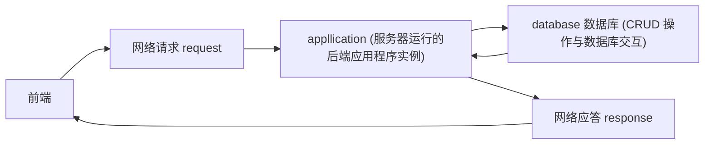

# 数据库 --（个人浅谈）


## 概况

我尽量用通俗易懂的语言描述我对于数据库的认识，个人见解，可能会有偏差。


## 结构化数据与非结构化数据

### 结构化数据

首先是结构化数据，根据定义结构化数据指的是由二维表结构来逻辑表达和实现的数据，严格遵循数据格式与长度规范，也称作为行数据。特点为：数据以行为单位，一行数据表示一个实体的信息，每一行数据的属性是相同的，一行又称为一个数据项。例如：

| id   | name | age  | phone       |
| ---- | ---- | ---- | ----------- |
| 1    | 张三 | 18   | 17623423411 |
| 2    | 李四 | 21   | 12834126544 |
| 3    | 王五 | 23   | 13813329332 |

### 非结构化数据

非结构化数据，指的是数据结构不规则或不完整，没有任何预定义的数据模型，不方便用二维逻辑表来表现的数据，例如办公文档（Word）、文本、图片、HTML、各类报表、视频音频等。


## 关系型数据库与非关系型数据库

数据库分为关系型数据库和非关系型数据库。

### 关系型数据库

用于存储结构化数据。经典操作有四种：增删改查，又称 CRUD （create, retrieve, update, delete）。

传统经典的数据库（传统经典不意味着过时，反而在现在依然是最重要的一种数据库类型）。通俗点来讲，关系型数据库的内容就是这样的一张张表格（二维逻辑，类似于 excel）：


#### 查询

拿此用户表 users 举例，以一行为单位（第一行是用户1，第二行是用户2，第三行是用户3...）。
列规定每行需要有什么属性，（需要有 openid 序号，userName 用户名，bean 豌豆余额， skill 擅长技能...）

```sql
# * 表示把所有属性查询出来。这个 sql 的作用是把满足 openId = '1' 的行 的所有属性查询出来
select * from users
where openId = '1';
```

查询结果：


并不一定所有查询都能得到 1 行数据，只是恰好只有一行匹配查询条件。当多行都匹配查询条件时，查询出来的内容也是多行：

```sql
# 这个 sql 的作用是把满足 freeShare = 3 的行 的所有属性查询出来
select * from users
where freeShare = 3;
```

查询结果：


#### 更新

```sql
# 把 openId 为 'oosr35Yl3YiwqUdqyWMQc90W4jtM' 的数据项的 userName 更改为 '喷气式战斗机'
update users
set userName = '喷气式战斗机'
where openId = 'oosr35Yl3YiwqUdqyWMQc90W4jtM';
```


#### 新增

```sql
# 新增一个数据项到 users 表中，数据项内容：('666777888', '喷气式新飞机', 10)
insert into users(openId, name, bean)
values ('666777888', '喷气式新飞机', 10);
```

新增结果：


#### 删除

```sql
# 在 users 表中删除 openId 为 '666777888' 的数据项
delete from users
where openId = '666777888';
```

删除结果（openId = '666777888' 的数据项已查找不到）：


### 非关系型数据库（NoSql）

用于存储非结构化数据，非关系型数据库不是一张表（不是二维逻辑）。

非关系型数据库用来管理非结构化数据。此类数据库没有通用的规范，数据库的设计围绕所存储的数据内容而展开。

例如：redis, elasticsearch, HBase, MongoDB 等。

各自代表存储的内容类别：

#### KV型 NoSql（代表----Redis）

redis 适合用作缓存（把指定的数据先加载进内存等待读取）。

- 基于内存存储，读写效率高。

- KV型数据，时间复杂度为O(1)，查询速度快。

并不是所有数据都对增删改查有着均匀的需求，对于某些需求，**大量的数据读频次远远大于写频次**（读：查询，写：增删改）。

例如百度百科，某个词条每天有上万次的查询，但这个词条几个月都不一定会修改一次。这种数据就很适合使用缓存来优化性能。

##### 作用

- 适合存储**读频次远远大于写频次的数据**。

#### 搜索型 NoSql（代表----ElasticSearch）

搜索型 NoSql 的诞生正是为了**解决关系型数据库全文搜索能力较弱的问题**，ElasticSearch 是搜索型NoSql的代表产品。

例如当我们输入关键字进行百度搜索时，搜索得到的网页里均包含输入的关键字，这就使用了搜索型数据库。搜索型数据库将数据内容进行分词，然后使用倒排索引为数据内容的关键字建立一张表格：


四个短句：

- "Tom is Tom"
- "Tom is my friend"
- "Thank you, Betty"
- "Tom is Betty's husband"

搜索引擎会根据一定的切分规则将这句话切成N个关键字，并以关键字的维度维护关键字在每个文本中的出现次数。这样下次搜索"Tom"的时候，由于Tom这个词语在"Tom is Tom"、"Tom is my friend"、"Tom is Betty's husband"三句话中都有出现，因此这三条记录都会被检索出来，且由于"Tom is Tom"这句话中"Tom"出现了2次，因此这条记录对"Tom"这个单词的匹配度最高，最先展示。

##### 作用

- 搜索型NoSql最适用的场景就是**有条件搜索尤其是全文搜索的场景**，作为关系型数据库的一种替代方案。

- 另外，搜索型数据库还有一种特别重要的应用场景。我们可以想，一旦对数据库做了分库分表后，原来可以在单表中做的聚合操作、统计操作是否统统失效？例如我把订单表分16个库，1024张表，那么订单数据就散落在1024张表中，我想要统计昨天浙江省单笔成交金额最高的订单是哪笔如何做？我想要把昨天的所有订单按照时间排序分页展示如何做？**这就是搜索型NoSql的另一大作用了，我们可以把分表之后的数据统一打在搜索型NoSql中，利用搜索型NoSql的搜索与聚合能力完成对全量数据的查询**。

#### 列式 NoSql（代表----HBase）

列式NoSql，大数据时代最具代表性的技术之一了，以HBase为代表。

列式NoSql是基于列式存储的，那么什么是列式存储呢，列式NoSql和关系型数据库一样都有主键的概念，区别在于关系型数据库是按照行组织的数据：


看到每行有name、phone、address三个字段，这是行式存储的方式，且可以观察id = 2的这条数据，即使phone字段没有，它也是占空间的。

列式存储完全是另一种方式，它是按每一列进行组织的数据：


这么做有什么好处呢？大致有以下几点：

- 查询时只有指定的列会被读取，不会读取所有列
- 存储上节约空间，Null值不会被存储，一列中有时候会有很多重复数据（尤其是枚举数据，性别、状态等），这类数据可压缩，行式数据库压缩率通常在3:1~5:1之间，列式数据库的压缩率一般在8:1~30:1左右
- 列数据被组织到一起，一次磁盘IO可以将一列数据一次性读取到内存中

第二点说到了数据压缩，什么意思呢，以比较常见的字典表压缩方式举例：


自己看图理解一下，应该就懂了。 

##### 作用

- **HBase比较适用于那种KV型的且未来无法预估数据增长量的场景**，另外HBase使用还是需要一定的经验，主要体现在RowKey的设计上。

#### 文档型 NoSql（代表----MongoDB）

什么是文档型NoSql呢，文档型NoSql指的是将半结构化数据存储为文档的一种NoSql，文档型NoSql通常以JSON或者XML格式存储数据，因此文档型NoSql是没有Schema的，由于没有Schema的特性，我们可以随意地存储与读取数据，因此文档型NoSql的出现是**解决关系型数据库表结构扩展不方便的问题的**。

MongoDB是文档型NoSql的代表产品，同时也是所有NoSql产品中的明星产品之一，因此这里以MongoDB为例。按我的理解，作为文档型NoSql，MongoDB是一款完全和关系型数据库对标的产品，就我们从存储上来看：


看到，关系型数据库是按部就班地每个字段一列存，在MongDB里面就是一个JSON字符串存储。关系型数据可以为name、phone建立索引，MongoDB使用createIndex命令一样可以为列建立索引，建立索引之后可以大大提升查询效率。其他方面而言，就大的基本概念，二者之间基本也是类似的：


因此，对于MongDB，我们只要理解成一个Free-Schema的关系型数据库就完事了。

- 总而言之，MongDB的使用场景很大程度上可以对标关系型数据库，但是**比较适合处理那些没有join、没有强一致性要求且表Schema会常变化的数据**。


## 数据库与应用的关系

非常精简的示意图，实际还有其它节点：



前端使用 API 发送网络请求 request 至服务器上运行的后端应用程序，后端应用程序与数据库进行数据交互，并进行逻辑处理，返回给前端网络应答 response，前后端的数据交互通过 request 和 response 携带传输。


## 拓展阅读

本文未对 非关系型数据库 的优缺点进行详细说明，关于 关系型数据库 与 非关系型数据库 的拓展延伸请见：[Sql Or NoSql，看完这一篇你就懂了 - 五月的仓颉 - 博客园](https://www.cnblogs.com/xrq730/p/11039384.html)


## 引用/参考

[Sql Or NoSql，看完这一篇你就懂了 - 五月的仓颉 - 博客园](https://www.cnblogs.com/xrq730/p/11039384.html)