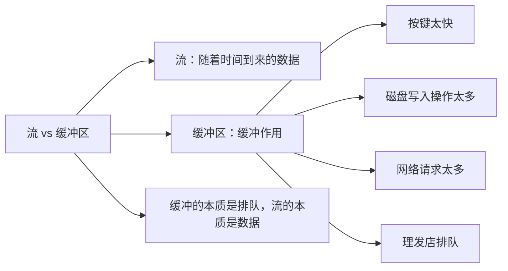
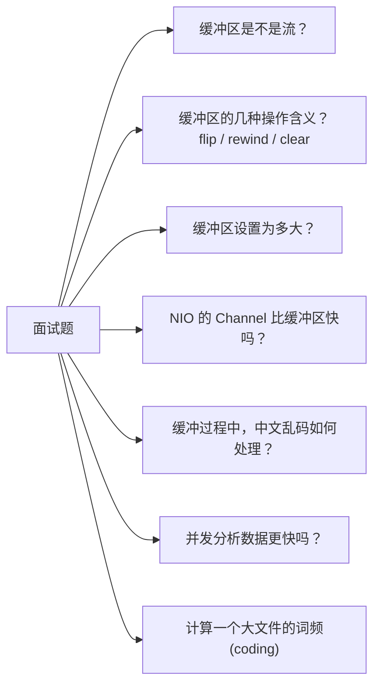
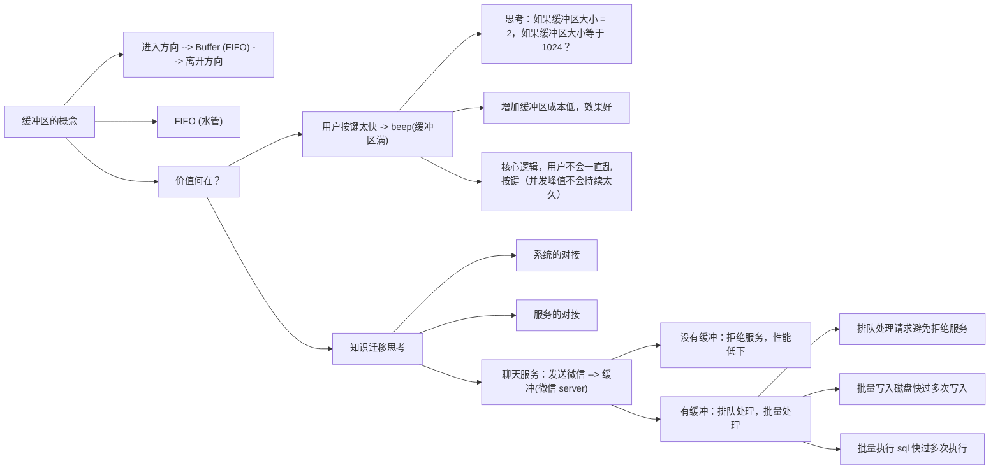

# Buffer 的原理和使用场景

## 流 vs 缓冲区

```mermaid
graph LR
A["流 vs 缓冲区"] --> B["流：随着时间到来的数据"]
A --> C["缓冲区：缓冲作用"]
C --> C1["按键太快"]
C --> C2["磁盘写入操作太多"]
C --> C3["网络请求太多"]
C --> C4["理发店排队"]
A --> D["缓冲的本质是排队，流的本质是数据"]
```

## 面试题

```mermaid
graph LR
A["面试题"] --> B["缓冲区是不是流？"]
A --> C["缓冲区的几种操作含义？flip / rewind / clear"]
A --> D["缓冲区设置为多大？"]
A --> E["NIO 的 Channel 比缓冲区快吗？"]
A --> F["缓冲过程中，中文乱码如何处理？"]
A --> G["并发分析数据更快吗？"]
A --> H["计算一个大文件的词频(coding)"]
```

## 缓冲区的概念

```mermaid
graph LR
A["缓冲区的概念"] --> B["进入方向 --> Buffer (FIFO) --> 离开方向"]
A --> C["FIFO (水管)"]
A --> D["价值何在？"]
D --> E["用户按键太快 -> beep(缓冲区满)"]
E --> E1["思考：如果缓冲区大小 = 2，如果缓冲区大小等于 1024？"]
E --> E2["增加缓冲区成本低，效果好"]
E --> E3["核心逻辑，用户不会一直乱按键（并发峰值不会持续太久）"]
D --> F["知识迁移思考"]
F --> F1["系统的对接"]
F --> F2["服务的对接"]
F --> F3["聊天服务：发送微信 --> 缓冲(微信 server)"]
F3 --> F31["没有缓冲：拒绝服务，性能低下"]
F3 --> F32["有缓冲：排队处理，批量处理"]
F32 --> F321["排队处理请求避免拒绝服务"]
F32 --> F322["批量写入磁盘快过多次写入"]
F32 --> F323["批量执行 sql 快过多次执行"]
```

