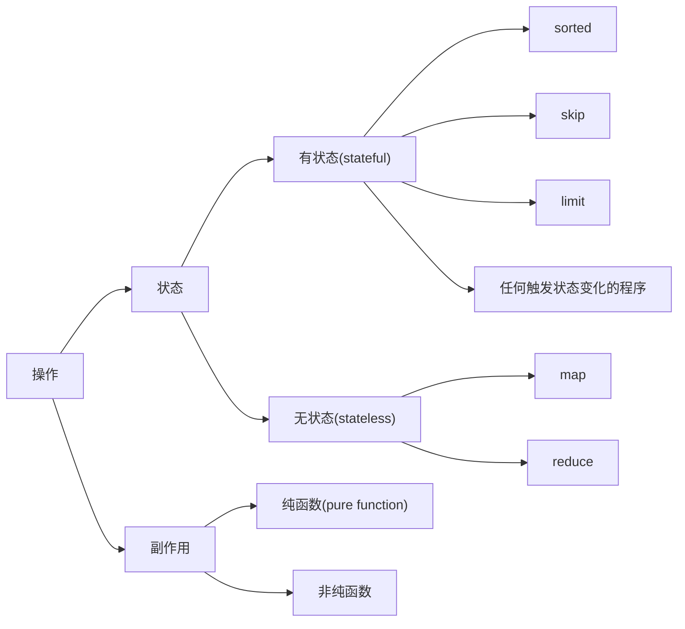

# lambda

## method

分为终结符和非终结符。非终结符会返回一个 pipeline。pipeline 接收上一个 pipeline 传递过来的数据。

虽然使用 lambda 会导致性能下降，比如 for 循环中边遍历边过滤效率会更高，但以效率为损失换来的可读性是目前普遍的做法。

在写一些注重性能的算法和底层库的时候不会使用这种损失性能提高可读性的方法。

### map

映射，非终结符。

### filter

过滤，非终结符。

### forEach

遍历，终结符。

# @FunctionaInterface

把 lambda expression 转换为 interface。