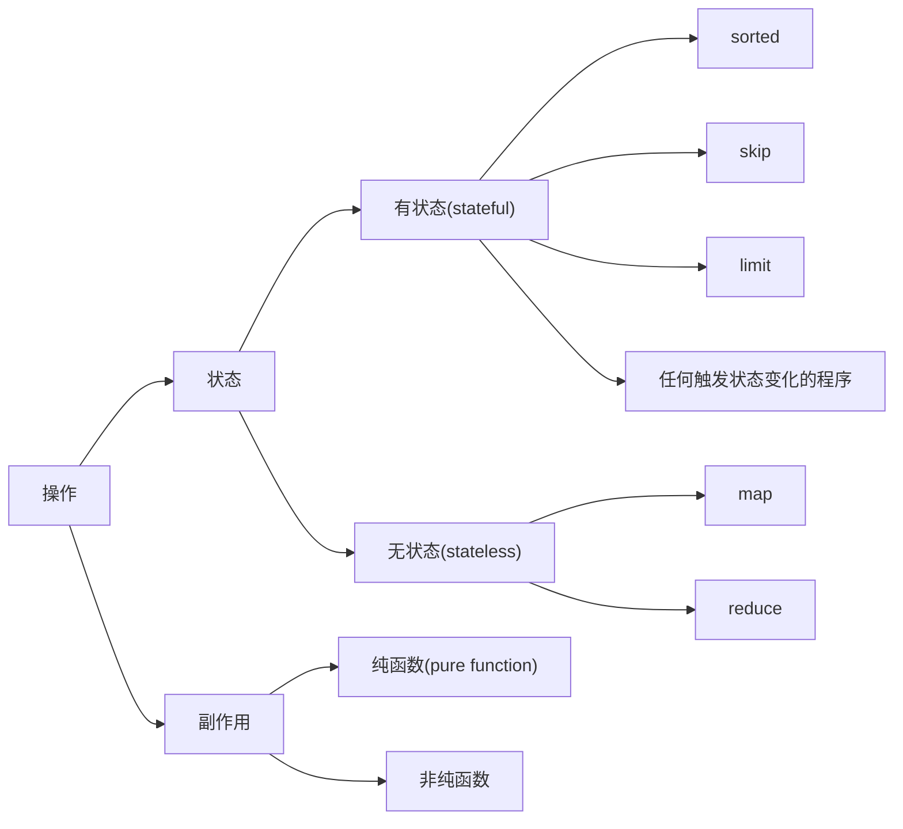
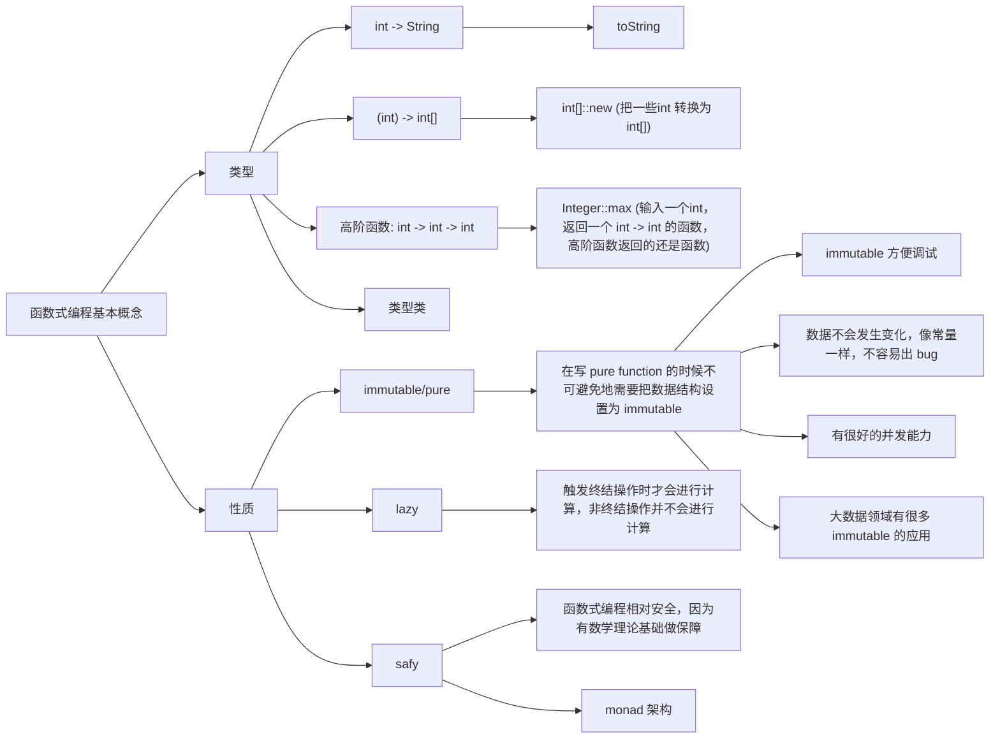

# lambda


## method

分为终结符和非终结符。非终结符会返回一个 pipeline。pipeline 接收上一个 pipeline 传递过来的数据。

虽然使用 lambda 会导致性能下降，比如 for 循环中边遍历边过滤效率会更高，但以效率为损失换来的可读性是目前普遍的做法。

在写一些注重性能的算法和底层库的时候不会使用这种损失性能提高可读性的方法。



### map

映射，非终结符。

### filter

过滤，非终结符。

### forEach

遍历，终结符。


## 函数式编程基本概念




## @FunctionaInterface

把 lambda expression 转换为 interface。


## Variable used in lambda expression should be final or effectively final

### 问题如图所示


修改后：


### 问题简化表述

```java
for (int index; index < 1000; index ++) {
    threadPool.execute(() -> {
    	System.out.println(index);
    });
}
```

报错，需要修改成：

```java
for (int index; index < 1000; index ++) {
	int finalIndex = index;
    threadPool.execute(() -> {
    	System.out.println(finalIndex);
    });
}
```

报错内容：

```
Variable used in lambda expression should be final or effectively final
```

从字面上来理解这句话，意思是：*lambda表达式中使用的变量应该是final或者有效的final*，也就是说，lambda 表达式只能引用标记了 final 的外层局部变量，这就是说不能在 lambda 内部修改定义在域外的局部变量，否则会编译错误。

原因：在lambda表达式中对变量的操作都是基于原变量的副本，不会影响到原变量的值。

假定没有要求lambda表达式外部变量为final修饰，那么开发者会误以为外部变量的值能够在lambda表达式中被改变，而这实际是不可能的，所以要求外部变量为final是在编译期以强制手段确保用户不会在lambda表达式中做修改原变量值的操作。

为什么会有这种规定？

其实在 Java 8 之前，匿名类中如果要访问局部变量的话，那个局部变量必须显式的声明为 final。

详细请看：[【Java异常】Variable used in lambda expression should be final or effectively final - No8g攻城狮 - CSDN](https://blog.csdn.net/weixin_44299027/article/details/117333667)

### 引用/参考

[【Java异常】Variable used in lambda expression should be final or effectively final - No8g攻城狮 - CSDN](https://blog.csdn.net/weixin_44299027/article/details/117333667)