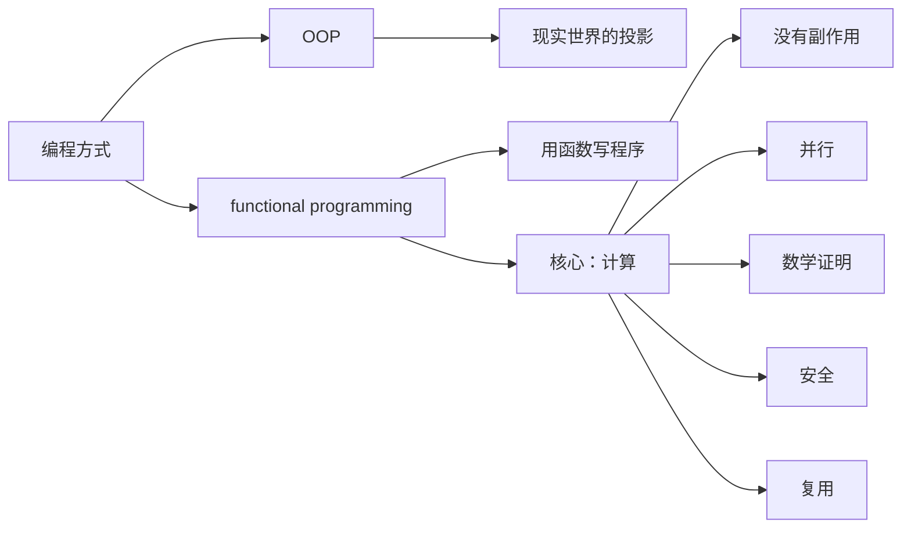
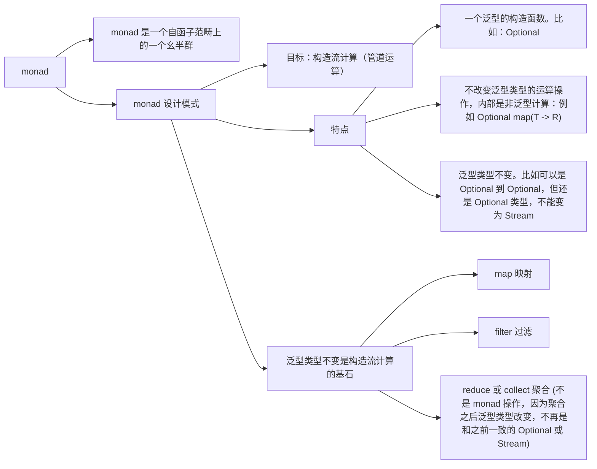
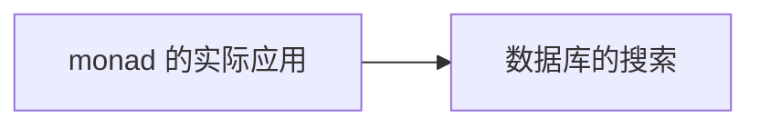

# 函数式的 Monad

```mermaid
graph LR
A[编程方式] --> B[OOP]
B --> B1[现实世界的投影]
A --> C[functional programming]
C --> D[用函数写程序]
C --> E["核心：计算"]
E --> F[没有副作用]
E --> G[并行]
E --> H[数学证明]
E --> I[安全]
E --> J[复用]
```

## Optional\<T>

专门针对流式计算。就是一个 monad。

```mermaid
graph LR
A[monad] --> B[monad 是一个自函子范畴上的一个幺半群]
A --> C[monad 设计模式]
C --> D["目标：构造流计算（管道运算）"]
C --> E[特点]
E --> F["一个泛型的构造函数。比如：Optional<T>"]
E --> G["不改变泛型类型的运算操作，内部是非泛型计算：例如 Optional<R> map(T -> R)"]
E --> H["泛型类型不变。比如可以是 Optional<Integer> 到 Optional<String>，但还是 Optional<T> 类型，不能变为 Stream<T>"]
C --> I["泛型类型不变是构造流计算的基石"]
I --> J["map 映射"]
I --> K["filter 过滤"]
I --> L["reduce 或 collect 聚合 (不是 monad 操作，因为聚合之后泛型类型改变，不再是和之前一致的 Optional 或 Stream)"]
```

```mermaid
graph LR
A[monad 的实际应用] --> B[数据库的搜索]

```

## duck type

动态类型的一种风格。在这种风格中，一个对象有效的语义，不是由继承自特定的类或实现特定的接口，而是由"当前方法和属性的集合"决定。

有很多的缺陷，不够严格，容易导致编程错误。

